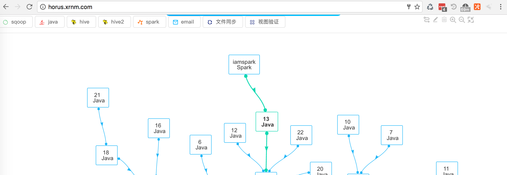

# vis-network-custom
vis network custom style

How to Use:

    1) npm install vis-network-custom;
    2) import Network from 'vis-network-custom';
    3) import 'vis-network-custom/app/styles/vis-network.css';
    4) use click event to replace. example for add node:
```
    clickable(document.querySelector('.vis-add'));

    //code for clickable
    export const clickable = (element) => {
      if (!element) {
        return;
      }
      if (/msie/i.test(navigator.userAgent)) {
        element.click();
      } else {
        let evt = new MouseEvent('click', {
        cancelable: true,
        bubble: true,
        view: window
        });
        element.dispatchEvent(evt);
      }
    };
```


### 0.0.8
    Change output file name.

### 0.0.7
    Use global variable.

### 0.0.6
    Delete some useless.

### 0.0.5
    To narrow down, enlarge and Restore the figure.

### 0.0.2
    add click event for addNode、addEdge、deleteNode...
    still keep Hammer events.

### 0.0.1
    use vis network, delete some useless files
[demo from visjs](http://visjs.org/examples/network/other/manipulation.html)
